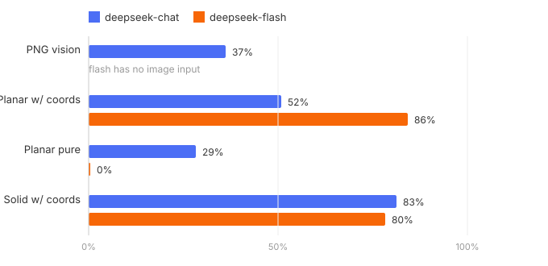

# GeoMark Leaderboard

> AI geometry-reasoning benchmark · 25 problems × 5 tracks, double-blind independent conversations · rubric-based scoring · cheat detection (secret coordinates when forbidden → zeroed)
> Updated: 2026-10-05 · Protocol: [README.md](README.md) · 中文版：[LEADERBOARD.zh.md](LEADERBOARD.zh.md)

## Leaderboard

| Model | PNG vision | Planar w/ coords | Planar pure | Solid w/ coords | Cheating | Score |
|---|---|---|---|---|---|---|
| deepseek-flash | — | 86% | 0% | 80% | 13 | **55.3** |
| deepseek-chat (V3.2) | 37% | 52% | 29% | 83% | 3 | **50.2** |

① flash has no image input, so its vision track is untested; score = mean of available tracks — cross-row comparison is not apples-to-apples. ② In this round, chat received figures in the coord/pure tracks while flash did not (mislabeled config flag; flash's numbers should be read as a text-only exam); v1.1 will ship figures uniformly in all modes and retest. ③ flash's 0% on planar-pure is a strict-rule outcome: all 13 coordinate-restricted problems were zeroed because coordinate scratchwork appeared in every chain-of-thought, most with full raw scores — see protocol.

## Key findings

1. **Told not to use coordinates, models set them up anyway.** chat was caught 3 times in its final answers; flash went further — coordinate scratchwork appeared in the chain-of-thought of all 13 restricted problems, even when the final answer used pure geometry. CoT makes "secret coordinate checks" impossible to hide; text-only benchmarks can't see this.
2. **Chain-of-thought ≠ stronger geometry.** flash's 86% with coordinates beats chat's 52%, but once coordinates are banned it collapses — speed-tier models have a thinner pure-geometry foundation.
3. **Figure understanding is the weakest skill.** chat scores 37% reading figures vs 52% reading text for the same problems.

## Candidate models

| Vendor | Models |
|---|---|
| OpenAI | gpt-6-astra、gpt-6.1-sol、gpt-6-sol、gpt-6-luna、gpt-5.6-sol、gpt-5.6-terra、gpt-5.6-luna |
| Anthropic | claude-fable-5-1、claude-fable-5、claude-opus-5-5、claude-sonnet-5-5、claude-haiku-4-5-20251001、claude-opus-5、claude-opus-4-8、claude-opus-4-7、claude-opus-4-6、claude-opus-4-5-20251101、claude-sonnet-5、claude-sonnet-4-6 |
| Google | gemini-3.8-flash、gemini-3.7-flash、gemini-3.6-flash、gemini-3.5-flash、gemini-3.5-flash-lite、gemini-3.1-flash-lite、gemini-3.1-pro-preview、gemini-3-flash-preview |
| Alibaba | qwen3.8-max、qwen3.8-flash、qwen3.8-27b、qwen3.7-plus、qwen3.6-plus、qwen3.6-flash、qwen3-coder-480b |
| ByteDance | doubao-seed-2.1-pro、doubao-seed-2.1-turbo、doubao-seed-2.1-lite、doubao-seed-2.0-pro、doubao-seed-2.0-lite、doubao-seed-evolving |
| Tencent | hunyuan-turbos、hunyuan-turbo-s、hunyuan-t1、hunyuan-a13b、hunyuan-pro、hunyuan-standard、hunyuan-lite、hunyuan-vision、hunyuan-turbos-vision、hunyuan-t1-vision、hunyuan-translation、hunyuan-translation-lite、hunyuan-role、hunyuan-functions |
| Baidu | ernie-5.1、ernie-5.0、ernie-5.0-thinking-preview、ernie-4.5-turbo-128k、ernie-4.5-turbo-32k、ernie-4.5-turbo-vl、ernie-4.5-turbo-vl-32k、ernie-x1.1-preview、ernie-4.5-vl-28b-a3b |
| Moonshot | kimi-k3、kimi-k2.8-preview、kimi-k2.7-code、kimi-k2.7-code-highspeed、kimi-k2.6 |
| DeepSeek | deepseek-v4-pro、deepseek-v41-flash、deepseek-v4-pro-0813、deepseek-v4-flash-0731、deepseek-v3.2 |
| Zhipu | glm-5.3、glm-5.3-flash、glm-5.2、glm-5.1、glm-5、glm-4-plus、glm-4-airx、glm-4-air、glm-4-long、glm-4-flashx、glm-4-flash、glm-4v-plus |
| StepFun | step-5-preview、step-3.7-flash、step-3.5-flash |
| MiniMax | minimax-m3、minimax-m3.1-flash-preview、minimax-m2.7、minimax-m2.5、minimax-m2.5-lightning、minimax-m2.1、minimax-m1、abab6.5、abab6.5s、abab6.5g、abab5.5s |
| Baichuan | Baichuan4、Baichuan4-Turbo、Baichuan4-Air、Baichuan3-Turbo、Baichuan3-Turbo-128k、Baichuan-M3、Baichuan-M2、Baichuan-M1 |
| iFlytek | spark-x2.5、spark-x2.5-4b、spark-x2.5-1.7b、spark-x2、spark-x2-flash、spark-x1.5、spark-ultra、spark-pro、spark-lite |
| Shanghai AI Lab | Intern-S2、Intern-S2-Preview-397B、internlm3、internlm2.5、internlm2-chat |
| Xiaomi | mimo-v2.5-pro、mimo-v2.5、mimo-v2-flash |

Roster verified online on 2026-10-05: flagship models of OpenAI, Anthropic, Google, DeepSeek, Alibaba, Moonshot, ByteDance, Zhipu and MiniMax were checked one by one; remaining series follow vendor docs. Note: the deepseek-chat / deepseek-reasoner legacy aliases are being retired; DashScope will sunset 30+ legacy model IDs on 2026-10-10.

## Run details

- [deepseek-chat report](benchmark/docs/results/lb-deepseek-chat/summary.md) · [deepseek-flash report](benchmark/docs/results/lb-deepseek-flash/summary.md) (per-problem scores, failure taxonomy, cheat evidence)
- Reproduce: `run-eval.mjs --model <id>` → `score.mjs --run <runid>` → `summarize.mjs`
