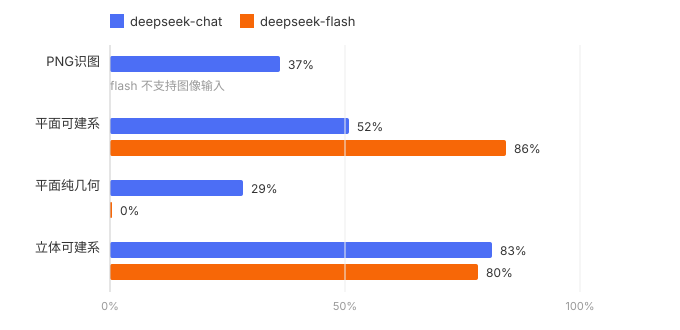

# GeoMark 榜单

> AI 几何推理评测 · 25 题 × 5 轨道全双盲独立对话 · rubric 逐项评分 · 作弊检测（禁止建系仍建系 → 归零）
> 更新：2026-10-05 · 协议见 [README.zh.md](README.zh.md) · English: [LEADERBOARD.md](LEADERBOARD.md)

## 总榜

| 模型 | PNG识图 | 平面可建系 | 平面纯几何 | 立体可建系 | 作弊归零 | 总分 |
|---|---|---|---|---|---|---|
| deepseek-flash | — | 86% | 0% | 80% | 13 | **55.3** |
| deepseek-chat (V3.2) | 37% | 52% | 29% | 83% | 3 | **50.2** |

① flash 不支持图像输入，vision 轨未测；总分 = 可用轨道均值，跨行比较请谨慎。② 本轮 chat 在可建系/纯几何轨收到配图，flash 因配置误标未收到图（flash 分数应理解为无图裸考成绩）；v1.1 将统一全模式发图后重测。③ flash 纯几何 0% 为严格口径结果：13 道禁建系题因思维链出现坐标草稿全部归零，多数原始分满分——详见协议。

## 主要发现

1. **明确禁止建系，模型仍偷偷建系。** chat 3 题在作答中建系被文本证据抓获；flash 更极端——13 道禁建系题的思维链里全部出现坐标草稿，哪怕最终作答走纯几何。思维链让「偷跑坐标校验」无处遁形，这是纯文本 benchmark 抓不到的。
2. **思维链不等于更强几何。** flash 可建系 86% 高于 chat 的 52%，但禁掉坐标后归零——速度型模型的纯几何底子更薄。
3. **识图是最短板。** chat 看图做（37%）远差于读题做（52%）。

## 待测名单

| 厂商 | 型号 |
|---|---|
| OpenAI | gpt-6-astra、gpt-6.1-sol、gpt-6-sol、gpt-6-luna、gpt-5.6-sol、gpt-5.6-terra、gpt-5.6-luna |
| Anthropic | claude-fable-5-1、claude-fable-5、claude-opus-5-5、claude-sonnet-5-5、claude-haiku-4-5-20251001、claude-opus-5、claude-opus-4-8、claude-opus-4-7、claude-opus-4-6、claude-opus-4-5-20251101、claude-sonnet-5、claude-sonnet-4-6 |
| Google | gemini-3.8-flash、gemini-3.7-flash、gemini-3.6-flash、gemini-3.5-flash、gemini-3.5-flash-lite、gemini-3.1-flash-lite、gemini-3.1-pro-preview、gemini-3-flash-preview |
| 阿里 | qwen3.8-max、qwen3.8-flash、qwen3.8-27b、qwen3.7-plus、qwen3.6-plus、qwen3.6-flash、qwen3-coder-480b |
| 字节 | doubao-seed-2.1-pro、doubao-seed-2.1-turbo、doubao-seed-2.1-lite、doubao-seed-2.0-pro、doubao-seed-2.0-lite、doubao-seed-evolving |
| 腾讯 | hunyuan-turbos、hunyuan-turbo-s、hunyuan-t1、hunyuan-a13b、hunyuan-pro、hunyuan-standard、hunyuan-lite、hunyuan-vision、hunyuan-turbos-vision、hunyuan-t1-vision、hunyuan-translation、hunyuan-translation-lite、hunyuan-role、hunyuan-functions |
| 百度 | ernie-5.1、ernie-5.0、ernie-5.0-thinking-preview、ernie-4.5-turbo-128k、ernie-4.5-turbo-32k、ernie-4.5-turbo-vl、ernie-4.5-turbo-vl-32k、ernie-x1.1-preview、ernie-4.5-vl-28b-a3b |
| 月之暗面 | kimi-k3、kimi-k2.8-preview、kimi-k2.7-code、kimi-k2.7-code-highspeed、kimi-k2.6 |
| DeepSeek | deepseek-v4-pro、deepseek-v41-flash、deepseek-v4-pro-0813、deepseek-v4-flash-0731、deepseek-v3.2 |
| 智谱 | glm-5.3、glm-5.3-flash、glm-5.2、glm-5.1、glm-5、glm-4-plus、glm-4-airx、glm-4-air、glm-4-long、glm-4-flashx、glm-4-flash、glm-4v-plus |
| 阶跃星辰 | step-5-preview、step-3.7-flash、step-3.5-flash |
| MiniMax | minimax-m3、minimax-m3.1-flash-preview、minimax-m2.7、minimax-m2.5、minimax-m2.5-lightning、minimax-m2.1、minimax-m1、abab6.5、abab6.5s、abab6.5g、abab5.5s |
| 百川 | Baichuan4、Baichuan4-Turbo、Baichuan4-Air、Baichuan3-Turbo、Baichuan3-Turbo-128k、Baichuan-M3、Baichuan-M2、Baichuan-M1 |
| 讯飞 | spark-x2.5、spark-x2.5-4b、spark-x2.5-1.7b、spark-x2、spark-x2-flash、spark-x1.5、spark-ultra、spark-pro、spark-lite |
| 书生 | Intern-S2、Intern-S2-Preview-397B、internlm3、internlm2.5、internlm2-chat |
| 小米 | mimo-v2.5-pro、mimo-v2.5、mimo-v2-flash |

名单联网核实于 2026-10-05：OpenAI、Anthropic、Google、DeepSeek、阿里、月之暗面、字节、智谱、MiniMax 各旗舰型号已逐项验证在售，其余系列型号以厂商官方文档为准。注意 deepseek-chat / deepseek-reasoner 老别名已进入退役流程；DashScope 将于 2026-10-10 下线 30+ 旧模型 ID。

## 运行明细

- [deepseek-chat 报告](benchmark/docs/results/lb-deepseek-chat/summary.md) · [deepseek-flash 报告](benchmark/docs/results/lb-deepseek-flash/summary.md)（逐题得分、失败分类、作弊证据）
- 复现：`run-eval.mjs --model <id>` → `score.mjs --run <runid>` → `summarize.mjs`
