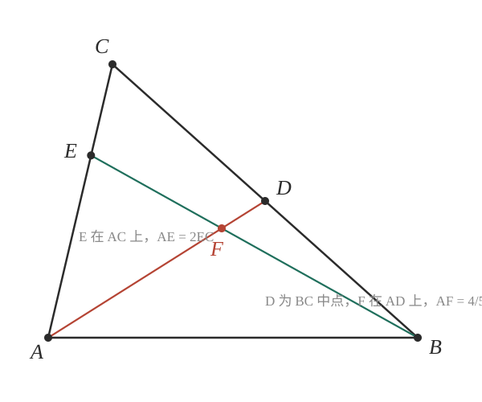

# GM-0002

> 知识范围：人教A版数学必修二 · 平面向量单元

如图，$\triangle ABC$ 中，$D$ 为 $BC$ 的中点，$E$ 在边 $AC$ 上，且 $AE = 2EC$。设 $\overrightarrow{AB} = \vec{a}$，$\overrightarrow{AC} = \vec{b}$，点 $F$ 在线段 $AD$ 上，且 $\overrightarrow{AF} = \dfrac{4}{5}\overrightarrow{AD}$。

**求证：$B$、$E$、$F$ 三点共线。**

---

**作答要求**：给出完整推理过程；须写明每一步所用的向量分解与共线判定依据。
