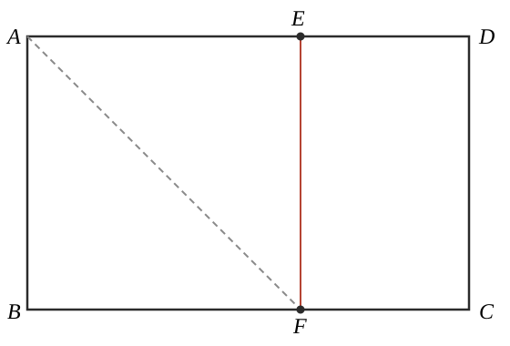
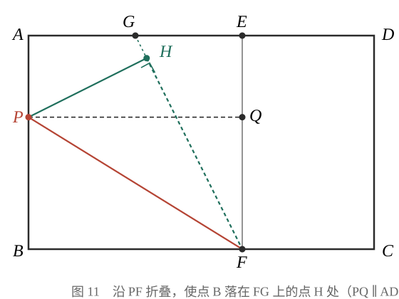

# GM-0004

> 知识范围：人教A版数学必修二 · 平面向量单元（黄金矩形与折叠综合）

**操作一**：如图 10，矩形 $ABCD$ 是黄金矩形（宽与长之比为 $\dfrac{\sqrt{5}-1}{2}$），长 $AD = \sqrt{5}+1$。沿 $AF$ 折叠，使点 $B$ 恰好落在边 $AD$ 上的点 $E$ 处，折痕 $AF$ 交 $BC$ 于点 $F$。

**（1）** 求 $AB$ 的长；
**（2）** 求证：四边形 $CDEF$ 是黄金矩形。

**操作二**：如图 11，点 $G$ 为 $AE$ 的中点，点 $P$ 在边 $AB$ 上，将 $\triangle PBF$ 沿 $PF$ 折叠，使点 $B$ 恰好落在射线 $FG$ 上的点 $H$ 处；过点 $P$ 作 $PQ \parallel AD$，交 $EF$ 于点 $Q$。

**（3）** 判断四边形 $BFQP$ 是否为黄金矩形，并证明你的结论。

---

**作答要求**：（1）给出数值；（2）（3）给出完整证明，折叠性质的使用须写明对应关系（折痕前后的等长、等角）。
