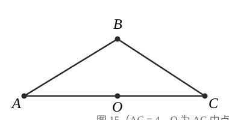
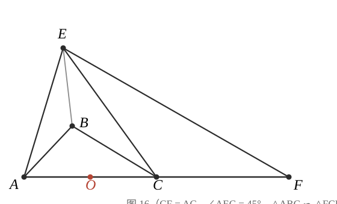

# GM-0005

> 知识范围：几何综合（尺规作图 · 相似三角形 · 圆周角定理 · 最值）

**（1）** 如图 15，$AC = 4$，$O$ 为 $AC$ 的中点，点 $B$ 在直线 $AC$ 上方，连接 $AB$、$BC$。尺规作图：作点 $B$ 关于点 $O$ 的对称点 $D$（保留作图痕迹，不写作法），连接 $AD$、$DC$，并证明四边形 $ABCD$ 为平行四边形。

**（2）** 如图 16，延长 $AC$ 至点 $F$，使得 $CF = AC$。当点 $B$ 在直线 $AC$ 上方运动，直线 $AC$ 上方有异于点 $B$ 的动点 $E$，连接 $EA$、$EB$、$EC$、$EF$。若 $\angle AEC = 45^\circ$，且 $\triangle ABC \backsim \triangle FCE$：

**①** 求证：$\triangle ABC \backsim \triangle CBE$；

**②** $CB$ 的长是否存在最大值？若存在，求出该最大值；若不存在，请说明理由。

---

**作答要求**：（1）描述作图步骤并完成证明；（2）①写出完整的相似判定链条；（2）②须说明最值取得的条件（端点是否可取）。
