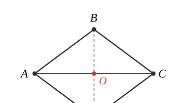

# GM-0005 解析

## （1）作图与平行四边形证明

**作图**：连接 $BO$ 并延长，在延长线上截取 $OD = OB$，得到点 $D$，连接 $AD$、$CD$。

**证明**：$O$ 为 $AC$ 中点，故 $AO = OC$；由作图 $BO = OD$。四边形 $ABCD$ 的对角线 $AC$、$BD$ 互相平分，故四边形 $ABCD$ 为平行四边形。$\blacksquare$

## （2）① 证明 △ABC ∽ △CBE

由 $\triangle ABC \backsim \triangle FCE$（对应 $A\to F,\ B\to C,\ C\to E$）：

$$
\angle BAC = \angle F,\qquad \angle ACB = \angle FEC,\qquad \frac{AB}{FC} = \frac{BC}{CE}
$$

$\angle ACE$ 是 $\triangle CEF$ 在顶点 $C$ 处的外角（$A$、$C$、$F$ 共线）：

$$
\angle ACE = \angle F + \angle CEF
$$

又由图构型 $\angle ACE = \angle ACB + \angle BCE$，代入上式并利用 $\angle F = \angle BAC$、$\angle CEF = \angle ACB$：

$$
\angle ACB + \angle BCE = \angle BAC + \angle ACB
\quad\Longrightarrow\quad
\angle BCE = \angle BAC
$$

由 $\dfrac{AB}{FC} = \dfrac{BC}{CE}$ 及 $FC = AC$：

$$
\frac{AB}{AC} = \frac{BC}{CE}
\quad\Longleftrightarrow\quad
\frac{AB}{BC} = \frac{AC}{CE}
$$

在 $\triangle ABC$ 与 $\triangle CBE$ 中：$\angle BAC = \angle BCE$（夹角相等），且夹角的两边成比例 $\dfrac{AB}{AC} = \dfrac{BC}{CE}$，由两边成比例且夹角相等：

$$
\triangle ABC \backsim \triangle CBE \qquad \blacksquare
$$

## （2）② CB 的最大值为 2√2（存在）

**辅助圆。** $\angle AEC = 45^\circ$ 定角、$AC = 4$ 定弦：点 $E$ 在 $\triangle AEC$ 的外接圆 $\odot O'$ 的（上侧）弧上运动。由圆周角定理，圆心角 $\angle AO'C = 2\angle AEC = 90^\circ$，故

$$
O'A = O'C = \frac{AC}{2\sin 45^\circ} = 2\sqrt{2}
$$

**辅助点 G。** 设直线 $EF$ 与 $\odot O'$ 的另一交点为 $G$。由 $A$、$C$、$F$ 共线，$\angle GAF = \angle GAC$；由 $E$、$G$、$F$ 共线，$\angle CEF = \angle CEG$。二者同为对弧 $\overset{\frown}{CG}$ 的圆周角：

$$
\angle GAF = \angle CEF = \angle ACB
$$

又 $\angle GFA = \angle EFC = \angle F = \angle BAC$。在 $\triangle BAC$ 与 $\triangle GFA$ 中两角对应相等：

$$
\triangle BAC \backsim \triangle GFA
\quad\Longrightarrow\quad
\frac{BC}{AG} = \frac{AC}{AF}
$$

$CF = AC = 4$，故 $AF = 8$：

$$
\frac{BC}{AG} = \frac{4}{8} = \frac{1}{2}
\quad\Longrightarrow\quad
BC = \frac{1}{2}\,AG
$$

**最值。** $E$ 在圆上运动时 $G$ 亦在圆上运动，$AG$ 是 $\odot O'$ 的一条弦，其最大值为直径 $2 \times 2\sqrt{2} = 4\sqrt{2}$。故

$$
BC_{\max} = \frac{1}{2}\times 4\sqrt{2} = 2\sqrt{2}
$$

**最值可达性（补足边界）。** $AG$ 为直径时 $G$ 为 $A$ 的对径点 $(4,4)$，此时直线 $EF$ 恰与 $\odot O'$ 相切于 $G$，$G$ 与 $E$ 重合，上述"另一交点"构造在此点失效，须单独验证。直接取 $E = (4,4)$（坐标系 $A(0,0),C(4,0)$）：$\triangle FCE$ 为等腰直角三角形，$\triangle ABC$ 为等腰直角三角形（$B=(2,2)$，$AB=BC=2\sqrt2$，$\angle ABC=90^\circ$），逐一检验：$\angle AEC = 45^\circ$ ✓、$E \neq B$ 且均在直线上方 ✓、$\triangle ABC \backsim \triangle FCE$ ✓。故 $BC = 2\sqrt{2}$ **确实取到**。

$$
\boxed{\;BC_{\max} = 2\sqrt{2}\;}
$$

## 评分要点

1. （1）作图正确（保留痕迹）+ 对角线互相平分 ⇒ 平行四边形；
2. （2）①外角转移 $\angle ACE = \angle F + \angle CEF$ 与和角拆分 $\angle ACE = \angle ACB + \angle BCE$ 结合，导出 $\angle BCE = \angle BAC$；
3. （2）①由比例 $\dfrac{AB}{FC} = \dfrac{BC}{CE}$ 换元为 $\dfrac{AB}{AC} = \dfrac{BC}{CE}$，SAS 判定收尾；
4. （2）②识别定角定弦 ⇒ 辅助圆，并用圆周角定理把 $\angle AEC$ 固定的条件转化为 $E$ 在弧上运动；
5. （2）②构造 $G$、证明 $\triangle BAC \backsim \triangle GFA$、得 $BC = \frac12 AG$，并用"弦最大为直径"收尾；
6. 说明最值可取（或至少给出取等条件）。

## 严谨性备注（供审题参考）

- 角 chase 步骤使用"$CB$ 在 $\angle ACE$ 内部"的图构型；$E$ 在上弧运动时该构型保持（$B$、$E$ 同在直线上方且相似关系限定位置）。
- 辅助构造"设 $EF$ 与 $\odot O'$ 交于点 $G$（异于 $E$）"在最值点处失效：$AG$ 为直径时 $G$ 为 $A$ 的对径点，$EF$ 恰为切线，$G$ 与 $E$ 重合。此时结论须按上节"可达性补足"直接验证，否则严格说来只得到上确界而非最大值。常见阅卷口径不扣此分，但作为 Benchmark 项应在作答中体现边界意识。
- $\angle AEC = 45^\circ$ 自动排除 $E$ 在下侧弧（该处 $\angle AEC = 135^\circ$），与"直线 $AC$ 上方"一致。

## 通用技巧

- **定角对定弦 ⇒ 辅助圆**：看到"定线段 + 对它张角恒定"，立刻作外接圆，把"动点"变成"弧上的点"，最值问题变成"弦长最值"。
- **弦长的最大值 = 直径**（共线且过圆心）；若辅助构造在直径位置退化，改在退化位置直接验证。
- 相似传递链：$\triangle ABC \backsim \triangle FCE$ 同时是角度库（$\angle F = \angle BAC$、$\angle CEF = \angle ACB$）和比例库（$AB/FC = BC/CE$），第二组相似往往只需"转角 + 换比例"两步。
- 外角定理拆角：$\angle ACE = \angle F + \angle CEF$，是共线图形中转移角度的利器。
