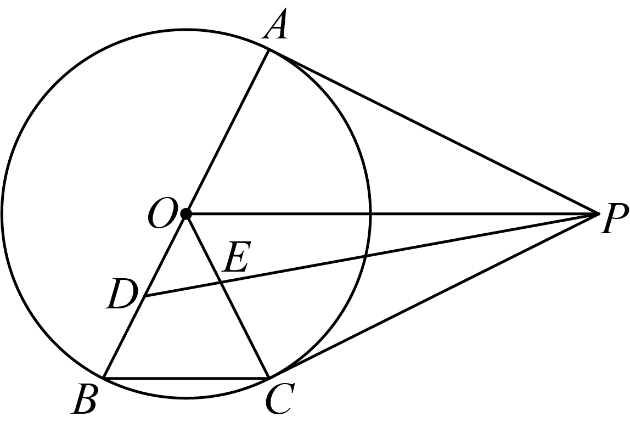

# GM-0101

> 知识范围：初中数学 · 切线的判定 / 直径所对圆周角 / 垂直平分线
> 来源：2026年江苏省苏州市中考数学试题 第25题（第一试卷网 www.shijuan1.com（免费中考真题））

如图，$P$ 是以 $AB$ 为直径的 $\odot O$ 外一点，$C$ 为 $\odot O$ 上的一点，$PA$ 是 $\odot O$ 的切线，$BC\parallel OP$，$D$ 为 $OB$ 的中点，连接 $DP$ 交 $OC$ 于 $E$．

（1）求证：$PC$ 是 $\odot O$ 的切线；

（2）若 $OA=2$，$PA=4$．
①求 $BC$ 的长；
②求 $\tan\angle PEC$ 的值．

---

**作答要求**：写出完整、严谨的推理过程；每一步须注明所用定理或性质；数值答案须给出精确值（可含根号、分数），不得只给近似小数。
