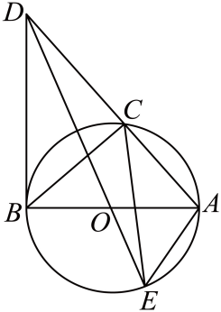

# GM-0102

> 知识范围：初中数学 · 外接圆 / 切线的性质 / 圆周角定理
> 来源：2025年甘肃省兰州市中考数学试题 第24题（第一试卷网 www.shijuan1.com（免费中考真题））

如图，$\odot O$ 是 $\triangle ABC$ 的外接圆，$AB$ 是 $\odot O$ 的直径，过点 $B$ 的切线交 $AC$ 的延长线于点 $D$，连接 $DO$ 并延长，交 $\odot O$ 于点 $E$，连接 $AE$，$CE$．

（1）求证：$\angle ADB=\angle AEC$；

（2）若 $AB=4$，$\cos\angle AEC=\dfrac{\sqrt{5}}{3}$，求 $OD$ 的长．

---

**作答要求**：写出完整、严谨的推理过程；每一步须注明所用定理或性质；数值答案须给出精确值（可含根号、分数），不得只给近似小数。
