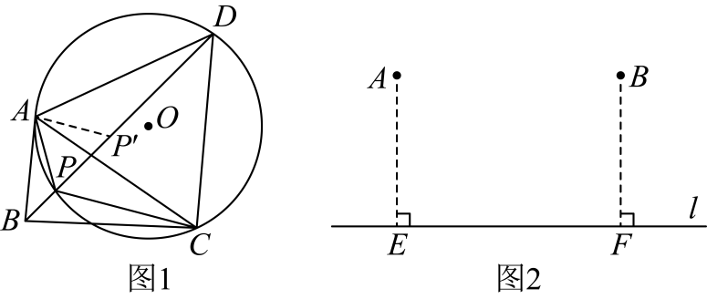
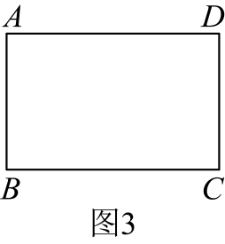

# GM-0105

> 知识范围：初中数学 · 最短路径 / 等边三角形与旋转 / 圆周角定理
> 来源：2026年江苏省连云港市中考数学试题 第27题（第一试卷网 www.shijuan1.com（免费中考真题））

【问题情境】

（1）在锐角 $\triangle ABC$ 中，求作一点 $P$，使 $PA+PB+PC$ 的值最小．

下面是小明对该问题的一种解决方法及简要说理．

如图1，以 $AC$ 为边向外作等边三角形 $ACD$，再作 $\triangle ACD$ 的外接圆 $\odot O$，连接 $BD$，与 $\odot O$ 交于点 $P$．则点 $P$ 即为求作的点．在 $PD$ 上取一点 $P'$，使 $PP'=AP$，连接 $AP'$．在 $\odot O$ 中，根据「同弧所对的圆周角相等」，得 $\angle APP'=$ ① $=60^\circ$，故 $\triangle APP'$ 是等边三角形．所以 $AP=PP'$．进而可证得 $\triangle ADP'\cong\triangle ACP$．所以 $CP=DP'$．所以 $PB+PA+PC=BP+PP'+P'D=BD$．由 ②（从「两点之间线段最短」和「垂线段最短」中选择填空）可得，$BD$ 的长即为 $PA+PB+PC$ 的最小值．

【方法迁移】

（2）如图2，已知点 $A$，$B$ 到直线 $l$ 的距离 $AE=BF=4$，$EF=6$．在图中找一点 $P$，使点 $P$ 到点 $A$、点 $B$、直线 $l$ 的距离之和最小，简要说明作法，并求出最小值．

【拓展应用】

（3）若村庄 $A,B,C,D$ 的连线构成一个矩形，且 $AB=a$，$BC=b$（$a<b<3a$）．现要在矩形区域内铺设天然气管道，使四个村庄能够连接互通起来．请你设计管道路线总长最短的铺设方案（不需要说明理由），并直接写出路线总长（用含 $a,b$ 的代数式表示）．

---

**作答要求**：写出完整、严谨的推理过程；每一步须注明所用定理或性质；数值答案须给出精确值（可含根号、分数），不得只给近似小数。
