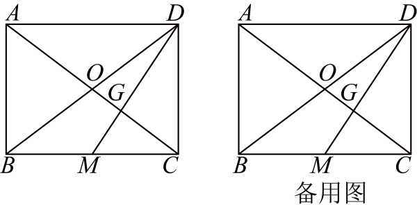

# GM-0106

> 知识范围：初中数学 · 矩形 / 三角形中位线 / 角平分线
> 来源：2025年江苏省南通市中考数学试卷 第25题（第一试卷网 www.shijuan1.com（免费中考真题））

如图，矩形 $ABCD$ 中，对角线 $AC,BD$ 相交于点 $O$．$M$ 是 $BC$ 的中点，$DM$ 交 $AC$ 于点 $G$．

（1）求证：$AG=2GC$；

（2）设 $\angle BCD,\angle BDC$ 的角平分线交于点 $I$．
①当 $AB=6,BC=8$ 时，求点 $I$ 到 $BC$ 的距离；
②若 $AB+AC=2BC$，作直线 $GI$ 分别交 $BD,CD$ 于 $E,F$ 两点，求 $\dfrac{EF}{BC}$ 的值．

---

**作答要求**：写出完整、严谨的推理过程；每一步须注明所用定理或性质；数值答案须给出精确值（可含根号、分数），不得只给近似小数。
