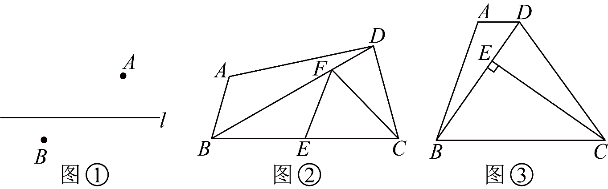

# GM-0107

> 知识范围：初中数学 · 最短路径 / 轴对称 / 两点之间线段最短
> 来源：2026年贵州省中考数学试题 第24题（第一试卷网 www.shijuan1.com（免费中考真题））

小红学习了最短路径的知识后，对图形的变化探究如下：

【动手操作】如图①，在直线 $l$ 的两侧有两点 $A$，$B$，小红要在直线 $l$ 上确定一点 $P$，使 $AP+BP$ 最短．

（1）请帮小红确定点 $P$ 的位置，并画出图形；

（2）解决该问题的依据是________；

【问题探究】

（3）如图②，在四边形 $ABCD$ 中，点 $E$ 是边 $BC$ 的中点，点 $F$ 是对角线 $BD$ 上一个动点，连接 $EF$，$CF$，$\angle DBC=30^\circ$，$BC=2\sqrt{3}$，当 $EF+CF$ 的值最小时，求线段 $EF$ 的长；

【拓展延伸】

（4）如图③，在四边形 $ABCD$ 中，$AD\parallel BC$，$BD=CD$，$CE\perp BD$，垂足为 $E$，$\angle A=2\angle ADB$，$AD=1$，$AB=3$，若点 $P$ 是线段 $BC$ 垂直平分线上的一个动点，连接 $BP$，$EP$．确定点 $P$ 的位置使 $\triangle BPE$ 周长最小，并求出该周长的最小值．

---

**作答要求**：写出完整、严谨的推理过程；每一步须注明所用定理或性质；数值答案须给出精确值（可含根号、分数），不得只给近似小数。
