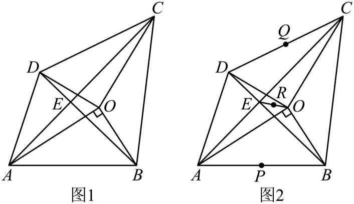

# GM-0108

> 知识范围：初中数学 · 旋转 / 面积关系 / 三点共线
> 来源：2025年江苏省徐州市中考数学真题 第28题（第一试卷网 www.shijuan1.com（免费中考真题））

如图1，将 $Rt\triangle AOB$ 绕直角顶点 $O$ 旋转至 $\triangle COD$，点 $A$，$B$ 的对应点分别为 $C$，$D$．连接 $AD,BC,AC,BD$，直线 $AC$ 与 $BD$ 交于点 $E$．

（1）$\triangle AOD$ 与 $\triangle BOC$ 的面积存在怎样的数量关系？请说明理由；

（2）如图2，连接 $OE$，若 $AB,CD,OE$ 的中点分别为 $P,Q,R$．求证：$P,Q,R$ 三点共线；

（3）已知 $AB=5$，随着 $OA,OB$ 及旋转角的变化，若存在以 $A,B,C,D$ 为顶点的四边形，其面积为 $S$，则 $S$ 的最大值为_______．

---

**作答要求**：写出完整、严谨的推理过程；每一步须注明所用定理或性质；数值答案须给出精确值（可含根号、分数），不得只给近似小数。
