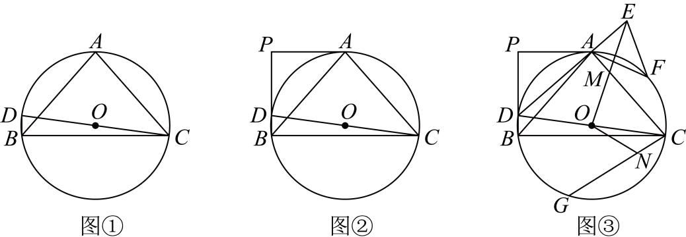

# GM-0109

> 知识范围：初中数学 · 圆周角定理 / 切线的性质 / 相似三角形 / 锐角三角函数 / 弧与弦的关系
> 来源：2025年黑龙江省哈尔滨市中考数学试题 第26题（第一试卷网 www.shijuan1.com 免费中考真题）

已知：$\triangle ABC$ 内接于 $\odot O$，圆心 $O$ 在 $\triangle ABC$ 的内部，$CD$ 为 $\odot O$ 的直径，连接 $BD$，$\angle BCD + 2\angle ABD = 90^\circ$．

（图1）

（1）如图①，求证：$AB = AC$；
（2）如图②，过点 $A$ 作 $\odot O$ 的切线，交 $BD$ 的延长线于点 $P$，求证：$BC = 2PA$；
（3）如图③，在（2）的条件下，$PD = 3BD$，连接 $DA$ 并延长至点 $E$，连接 $OE$ 交 $AC$ 于点 $M$，$OE = AB$，$G$ 为 $\overset{\frown}{BC}$ 上一点，$\overset{\frown}{DG} = \overset{\frown}{AD}$，连接 $CG$，点 $N$ 在 $CG$ 上，连接 $ON$，$\angle EON = 2\angle EDC$，$CN = 7$，点 $F$ 为 $\overset{\frown}{AC}$ 的中点，连接 $EF$，$AF$，求 $\triangle AEF$ 的面积．
27.

---

**作答要求**：写出完整、严谨的推理过程；每一步须注明所用定理或性质；数值答案须给出精确值（可含根号、分数），不得只给近似小数。
