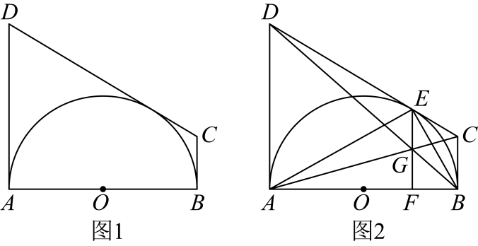

# GM-0110

> 知识范围：初中数学 · 切线的判定与性质 / 切线长定理 / 勾股定理与代数变形 / 相似三角形与比例线段 / 函数解析式的建立
> 来源：2025年湖南省长沙市中考数学试题 第25题（第一试卷网 www.shijuan1.com 免费中考真题）

如图1，点$O$是以$AB$为直径的半圆的圆心，$AD$与$BC$均为该半圆的切线，$C$，$D$均为直径$AB$上方的动点，连接$CD$，且始终满足$CD=AD+BC$．

（图1）

（1）求证：$CD$与该半圆相切；
（2）当半径$r=\sqrt{2}$时，令$AD=a$，$BC=b$，$m=\frac{2}{2+a}+\frac{2}{2+b}$，$n=\frac{a}{1+a}+\frac{b}{1+b}$，比较$m$与$n$的大小，并说明理由；
（3）在（1）的条件下，如图2，当半径$r=1$时，若点$E$为$CD$与该半圆的切点，$AC$与$BD$交于点$G$，连接$EG$并延长交$AB$于点$F$，连接$AE$，$BE$，令$EG=x$，$\frac{4}{AE\cdot BE}+\frac{1}{FG}+CD=y$，求$y$关于$x$的函数解析式．（不考虑自变量$x$的取值范围）

---

**作答要求**：写出完整、严谨的推理过程；每一步须注明所用定理或性质；数值答案须给出精确值（可含根号、分数），不得只给近似小数。
