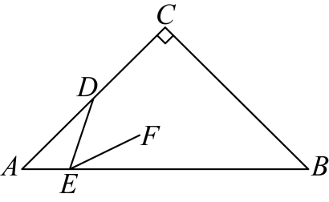

# GM-0111

> 知识范围：初中数学 · 等腰直角三角形性质 / 旋转的性质 / 全等三角形的判定与性质 / 平行线的性质 / 点到直线的距离
> 来源：2025年吉林省长春市中考数学试题 第23题（第一试卷网 www.shijuan1.com 免费中考真题）

如图，在 $\mathrm{Rt}\triangle ABC$ 中，$\angle C=90^\circ$，$AC=BC=4$，点 $D$ 为边 $AC$ 的中点，点 $E$ 为边 $AB$ 上一动点，连接 $DE$．将线段 $DE$ 绕点 $E$ 顺时针旋转 $45^\circ$ 得到线段 $EF$．

（图1）

（1）线段 $AB$ 的长为 ；
（2）当 $EF\parallel AC$ 时，求 $AE$ 的长；
（3）当点 $F$ 在边 $BC$ 上时，求证：$\triangle ADE\cong\triangle BEF$；
（4）当点 $E$ 到 $BC$ 的距离是点 $F$ 到 $BC$ 距离的2倍时，直接写出 $AE$ 的长．
24.

---

**作答要求**：写出完整、严谨的推理过程；每一步须注明所用定理或性质；数值答案须给出精确值（可含根号、分数），不得只给近似小数。
