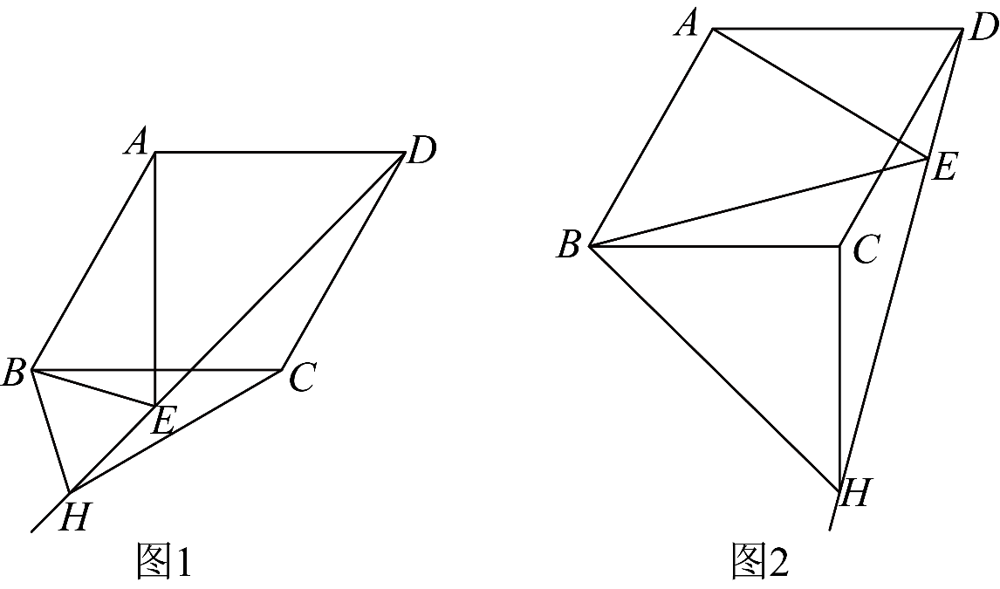

# GM-0112

> 知识范围：初中数学 · 菱形的性质 / 旋转的性质 / 等腰三角形与等边三角形 / 全等三角形 / 解直角三角形
> 来源：2026年河南省中考数学试题 第23题（第一试卷网 www.shijuan1.com 免费中考真题）

在菱形 $ABCD$ 中，$\angle BAD=120^\circ$，$AB=4$．将边 $AB$ 绕点 $A$ 逆时针旋转至 $AE$，记旋转角为 $\alpha$．作射线 $DE$，在射线 $DE$ 上取一点 $H$，使 $BH=BE$，连接 $CH$．

（图1）

（1）【观察猜想】
当 $\alpha=30^\circ$ 时，如图1，$\angle BEH$ 的度数为_________，$CH$ 的长为_________．
（2）【探究证明】
当 $0^\circ<\alpha<120^\circ$ 时，（1）中的两个结论是否仍然成立？若成立，请仅就图2的情形进行证明；若不成立，请说明理由．
（3）【拓展延伸】
当 $0^\circ<\alpha<120^\circ$ 时，若 $\triangle DCH$ 的面积为 $4\sqrt{2}$，请直接写出此时旋转角 $\alpha$ 的度数．

---

**作答要求**：写出完整、严谨的推理过程；每一步须注明所用定理或性质；数值答案须给出精确值（可含根号、分数），不得只给近似小数。
