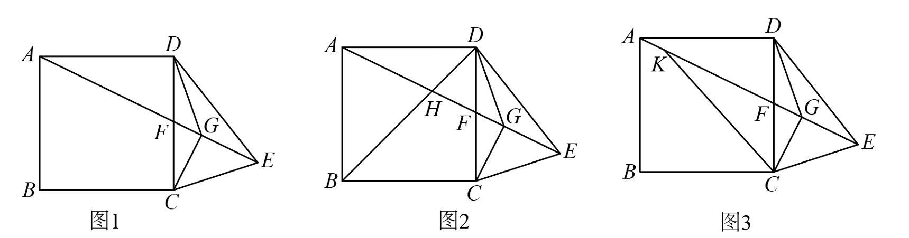

# GM-0113

> 知识范围：初中数学 · 正方形的性质 / 旋转的性质 / 等腰直角三角形的判定与性质 / 相似三角形与比例线段 / 圆与最值（轨迹思想）
> 来源：2026年湖北省武汉市中考数学试题 第23题（第一试卷网 www.shijuan1.com 免费中考真题）

将正方形 $ABCD$ 的边 $CD$ 绕点 $D$ 逆时针旋转得到 $DE$，连接 $AE$ 交边 $CD$ 于点 $F$，$DG$ 平分 $\angle CDE$ 交 $AE$ 于点 $G$，连接 $CG$、$CE$．

（图1）

（1）如图1，求证：$\triangle CGE$ 是等腰直角三角形（温馨提示：若思考有困难，可尝试证明 $\angle DAE = \angle DEG = \angle DCG$）．
（2）如图2，连接 $BD$ 交 $AE$ 于点 $H$，求证：$AF \cdot AE = 2AH \cdot AG$．
（3）如图3，点 $K$ 在线段 $AE$ 上，$AK = \frac{1}{2}CG$，连接 $CK$．若 $AB = 4$，直接写出 $CK$ 的最小值．
24.

---

**作答要求**：写出完整、严谨的推理过程；每一步须注明所用定理或性质；数值答案须给出精确值（可含根号、分数），不得只给近似小数。
