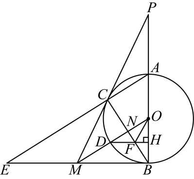

# GM-0114

> 知识范围：初中数学 · 切线的判定 / 切割线定理 / 相似三角形 / 三角形中位线 / 面积计算
> 来源：2026年云南省中考数学试题 第27题（第一试卷网 www.shijuan1.com 免费中考真题）

如图，$\odot O$ 是 $\triangle ABC$ 的外接圆，$AB$ 是 $\odot O$ 的直径．点 $P$ 在 $BA$ 的延长线上，且 $PC^2 = PA \cdot PB$．点 $E$ 在 $AC$ 的延长线上．线段 $BE$ 的中点 $M$ 与点 $C$、点 $P$ 在同一条直线上．线段 $OM$ 与 $\odot O$ 相交于点 $D$，与线段 $BC$ 相交于点 $N$．$DH \perp AB$ 于点 $H$，线段 $DH$ 与线段 $BC$ 相交于点 $F$，连接 $OF$．记 $\triangle OFD$ 的面积为 $S_1$，$\triangle OFH$ 的面积为 $S_2$．

（图1）

（1）求证：直线 $PC$ 是 $\odot O$ 的切线；
（2）若 $AB = 2\sqrt{21}$，$BE = 6\sqrt{6}$，求线段 $PA$ 的长；
（3）观察，探究，发现与证明：
以下三个结论：$S_1 < S_2$，S1=S2，$S_1 > S_2$，你认为哪个正确？请证明你认为正确的那个结论．

---

**作答要求**：写出完整、严谨的推理过程；每一步须注明所用定理或性质；数值答案须给出精确值（可含根号、分数），不得只给近似小数。
