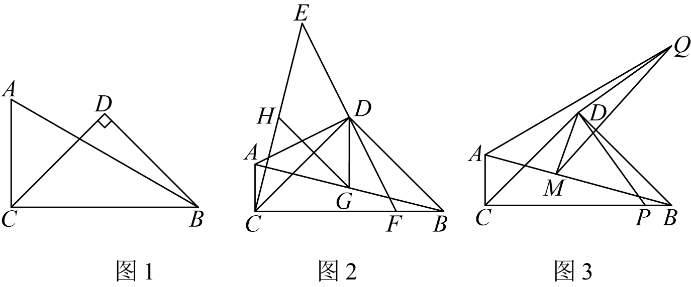

# GM-0115

> 知识范围：初中数学 · 等腰直角三角形性质 / 旋转与全等 / 勾股定理 / 三角形中位线定理 / 轴对称与最值
> 来源：2026年重庆市中考数学试题 第25题（第一试卷网 www.shijuan1.com 免费中考真题）

如图，在 $Rt\triangle ABC$ 中，$\angle ACB=90^\circ$，$BC>AC$，以 $BC$ 为斜边在 $BC$ 上方作等腰直角三角形 $BCD$．

（图1）

（1）如图1，若 $\angle ABC=30^\circ$，$BD=3$，求 $AC$ 的长度；
（2）如图2，连接 $AD$，将线段 $DA$ 绕点 $D$ 顺时针旋转 $90^\circ$ 得到线段 $DE$，延长 $ED$ 交 $BC$ 于点 $F$，连接 $CE$．点 $G$，$H$ 分别是 $AB$，$CE$ 的中点，连接 $DG$，$GH$．求证：$BC-AC=\sqrt{2}GH$；
（3）如图3，$BC=12$，$AC=3$，点 $P$ 在直线 $BC$ 上，连接 $DP$，将线段 $DP$ 绕点 $D$ 逆时针旋转 $90^\circ$ 得到线段 $DQ$，连接 $AQ$，点 $M$ 在直线 $AB$ 上，连接 $DM$，$QM$，将 $\triangle DMQ$ 沿直线 $DM$ 翻折至 $\triangle ABC$ 所在平面内得到 $\triangle DMN$，连接 $CN$．当 $AQ+DQ$ 取得最小值时，连接 $CQ$，$NQ$，请直接写出 $\triangle CQN$ 面积的最大值．

---

**作答要求**：写出完整、严谨的推理过程；每一步须注明所用定理或性质；数值答案须给出精确值（可含根号、分数），不得只给近似小数。
